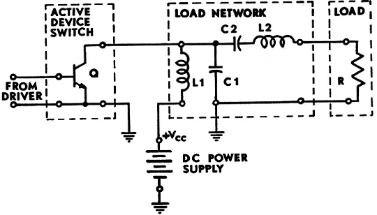
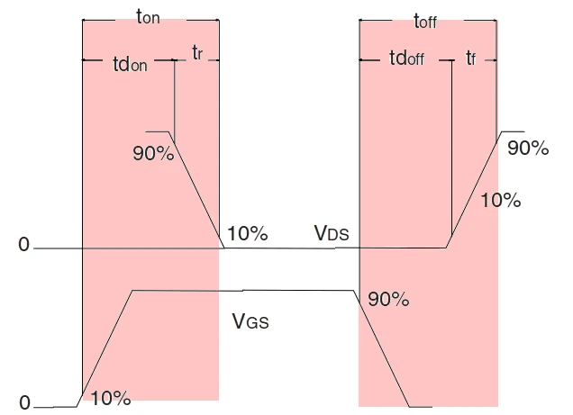
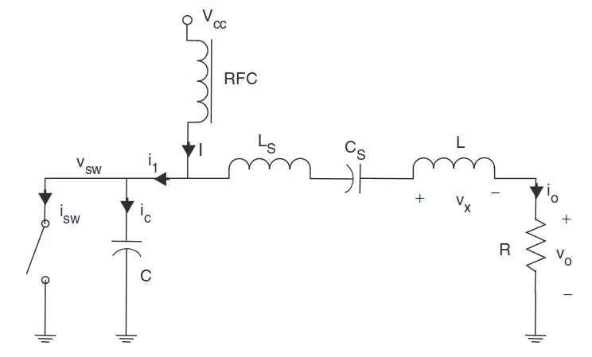
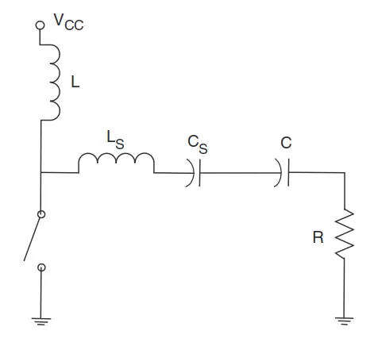
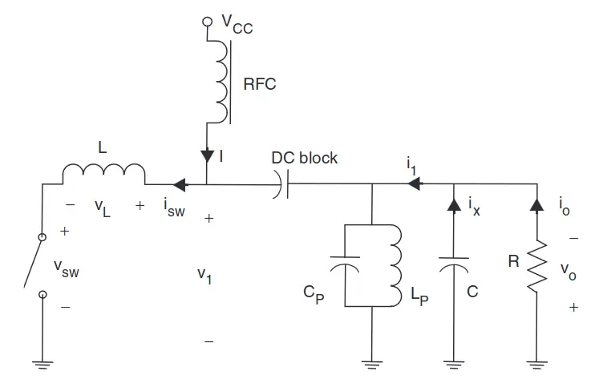
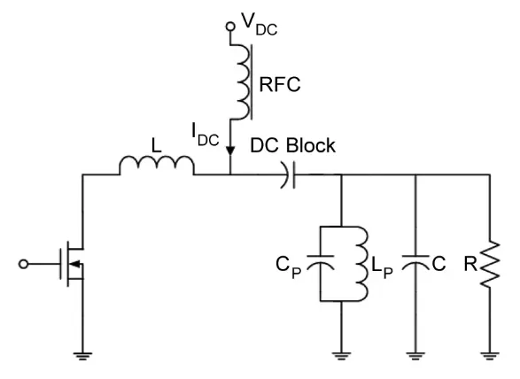

# classe2-calculator

__classe2-calculator__ calculates [Class-E Power Amplifier](https://en.wikipedia.org/wiki/Power_amplifier_classes#Class_E) circuit component values in order to assist with the practical design of Class-E Power Amplifier based circuits for RF communication, plasma control, or any other application. It is pronounced "[classi](https://en.wiktionary.org/wiki/classy#Adjective)[*er*](https://en.wiktionary.org/wiki/%E4%BA%8C#Pronunciation)", as an English-Mandarin [*portmanteau*](https://en.wikipedia.org/wiki/Blend_word).

## Why?

The motivation for writing this software was increasing frustration attempting to understand and explore the solution space for the design of surface mount component based systems using existing tools, coupled with the intent to perform similar calculations in the future. What distinguishes it from other options?

 * Open source
   * Reliable tool for exploration of the solution space
   * Transparent algorithms
   * Well documented design
 * Portable (runs on all platforms)
 * SI / metric units (no cubit foot-yard waveform eighth-of-a-bodypart handspannery here)
 * SMD design as a primary use case, thus the following are in scope:
   * SRF
   * Current
   * Zener protection against voltage peaks
 * Produces explainable (well documented) designs which can be readily audited.

## Potential output / feature-set / goals

 * __Primary schematic__
   * __Classic "Infinite" inductor subtype__
     * "Current driven": Based on zero voltage switching (ZVS) and zero voltage derivative switching (ZVDS) conditions
     * Identification: `L1 > (~10-15)×L2`
     * Invoke with `-t infinite`
     * Benefits:
       * Simple to design
       * Well understood in amateur circles
       * Excellent harmonic suppression.
     * Drawbacks:
       * Larger physical size (due to the large RF choke inductor)
       * Poorly suited to surface mount components, therefore not very manufacturable
       * More expensive components and assembly
       * Higher ESR losses
   * __"Finite" `L1` inductor subtype__
     * "Current driven": Based on zero voltage switching (ZVS) and zero voltage derivative switching (ZVDS) conditions
     * Identification: `L2 < L1 < 5×L2`
     * Key differences:
       * Smaller and cheaper inductor, more suited to surface mount manufacturing
     * Invoke with `-t finite`
     * Benefits:
       * Compromise between bandwidth and efficiency
       * Moderate selectivity and good harmonic suppression
       * Better suited to surface mount components
       * Physically smaller than classic "infinite" class E
       * Cheaper components
     * Drawbacks:
       * More complex to design
       * Less well understood in amateur circles
   * __Shunt capacitance and shunt filter subtype__
     * "Current driven": Based on zero voltage switching (ZVS) and zero voltage derivative switching (ZVDS) conditions
     * Identification: Addition of `L0`, sometimes no `L1` at all
     * Key differences:
       * Replaces the series filter with a shunt filter (`L0`), typically an LC circuit (ie. inductor plus capacitor), which can serve a dual purpose as DC-feed inductance.
       * Incorporates both shunt capacitance `C` (to absorb output capacitance) and series inductance `L` (to absorb output inductance)
       * In some cases, removes the RF Choke (`L1`) entirely
     * Invoke with `-t shunt`
       * `-o norfc` — remove the RF Choke (`L1`) entirely, by having `L0` take on a dual purpose role as DC-feed inductance, result in a more compact design
       * `-o srx` — include a series reactance `X` compensation, to increase suitability for broadband operation
       * `-o nocx` — remove the capacitance `CX` that is usually placed in parallel with the shunt filter and load resistance
     * Benefits:
       * Higher maximum operating frequency (fmax) compared to the classical Class-E PA and other variants.
       * Peak switch voltage does not grow as fast with increases in the quality factor under load (`QL`) as with traditional topologies, allowing higher frequency or power operations.
       * Better harmonic suppression
       * Option to remove the RF Choke (`L1`) entirely
       * Smaller inductance values result in a physically smaller and cheaper design with lower ESR
     * Drawbacks:
       * Complexity
       * Bandwidth limitations
       * Harmonic control
       * Impedance matching complexity
       * Manufacturability
       * Parasitic effects
       * Power handling limitations
       * Thermal management
   * __"Inverse" Class-E designs__
     * "Voltage driven": based on zero current switching (ZCS) and zero current derivative switching (ZCDS) conditions
     * Identification: `L1` < `L2`
     * Invoke with `-t inverse`
     * Benefits:
       * 20% lower peak switching voltage
       * Lower inductance values
       * Physically smaller (a significant benefit in [MMIC](https://en.wikipedia.org/wiki/Monolithic_microwave_integrated_circuit))
       * Higher load resistance
       * Inherent absorption of the transistor’s output inductances including bond wires
       * Better scope for optimization for high efficiency at higher output power level
       * Higher peak output power
       * Cheaper components
       * Suitable for high frequency applications such as microwave bands
     * Drawbacks:
       * Most complex to design
       * Poor selectivity and degraded harmonic suppression
   * Maybe later
     * Non-50% duty cycles
     * Push-Pull Class-E: A dual-ended design that uses two transistors operating 180 degrees out of phase, offering higher power and better even-harmonic suppression.
     * Differential Class-E: Similar to push-pull.
     * Outphasing Class-E: Dual Class-E amplifiers to implement a derivative of the Chireix outphasing technique allowing for efficient power control and linearization. 
     * Class-E with parallel circuit: Parallel resonant circuit in the load network offer advantages in certain applications.
     * Class-E with reactive impedance: Additional reactive components shape the load impedance, potentially improving performance or flexibility.
     * Class-E with resistive impedance: A resistive component in the load network, useful for certain design constraints or applications.
     * Class-E with second harmonic peaking: Deliberately introduces second harmonic components to reshape the voltage waveform and potentially improve efficiency.
     * Class-E/F: Hybrid topology combining features of Class-E and Class-F, improving efficiency by shaping both voltage and current waveforms.
     * Class-E/F Push-Pull: Dual-ended variant of the previous topology.
     * Class-E/F2,3: Specific variant of the Class-E/F family that uses second and third harmonic tuning to shape the waveforms.
     * Class-EF: Hybrid topology that incorporates aspects of both Class-E and Class-F designs to achieve high efficiency over a wider bandwidth.
     * Class-EM: Transmission line replaces some lumped elements in the load network, potentially allowing higher frequency operation.
     * Class-E3: Third harmonic peaking variant that aims to further optimize the switching conditions and efficiency.
     * Class-F design

 * __Antenna matching networks__
   * __L type__
   * __Pi type__
 * Antenna tuning unit (ATU) recommendations (maybe later)
 * SPICE simulation source (maybe later)
 * Coil core / winding instructions (maybe later)

## Class-E Schematic

### Classic Sokal / "Infinite" Class-E Topology

Taken from Sokal (1975).

 * `L1` = RF Choke inductor with high reactance at the fundamental frequency of operation.
 * `C1` = Shunt capacitor. Practically affected by switching MOSFET device output capacitance `C(OSS)`.
   * According to [classeradio](http://www.classeradio.com/rfvalues.htm): *The function of the shunt capacitance is to reduce the peak voltage appearing across the MOSFET when the device is in the off state, and to spread the width of the "off" pulse. The shunt capacitor is also part of the output matching network. This capacitor must be a high quality, high current component. Typically, multi-layer ceramic capacitors (MLCC) work best, however silver-mica capacitors can also be used in this function. The actual value of the shunt capacitor is important for a couple of reasons. First, if the capacitance is too small, you will see a very high RF peak voltage across your MOSFETs. If the value is too large, the efficiency can suffer. This is not an extremely critical value. [...] The shunt capacitor value is correct if the peak RF voltage across the MOSFETs during the "off" cycle is around 3.5 times the DC voltage applied to the stage. If the voltage is higher than this value, you may need to increase your shunt capacitor.*
 * `C2` / `L2` = Resonator
   * `C2` = "Tuning capacitor" (or "Series capacitor")
     * According to [classeradio](http://www.classeradio.com/rfvalues.htm): *The series tuning capacitor is subject to very high RF voltage [...] Using a lower inductance and higher capacitance in the resonant circuit will reduce the voltage across the tuning capacitor somewhat. A useful rule of thumb for figuring the tuning capacitor voltage rating is 3 to 5 times the peak to peak RF voltage fed to the resonant network plus a safety factor.*
 * `Q` = Active Device Switch (MOSFET)
   * According to [classeradio](http://www.classeradio.com/rfvalues.htm): *The peak voltage across the MOSFETs is going to be a little less than 4x the DC applied voltage for a proper class E transmitter. This will vary somewhat with tuning and your exact circuit. If you have very low, or NO shunt capacitor, the ratio of peak RF voltage to applied DC can be 6x or 8x the DC or MORE. For class E transmitters with proper shunt capacitors, figure 4x the DC, plus a safety factor.*
   * In the ideal situation, the efficiency of a class-E amplifier is 100%. However, in practice:
     * The switch has a finite on-resistance (`RDS(ON)`); and
     * The transition times (both from the off-state to the on-state (`t(on)`) and vice-versa (`t(off)`), and their related switching latencies (`td(on)` and `td(off)`) and rise/fall times (`t(r)` and `t(f)`)) are not negligible.
     * Both of these factors result in power dissipation in the switch and reduce the efficiency.  
   * Key selection criteria include:
     * On resistance (`RDS(ON)`; lower is better)
     * Capacitances (`C(RSS)`, `C(ISS)`, `C(OSS)`; lower is better)
     * Transition times (`td(on)`, `td(off)`, `t(r)`, `t(f)`; though apparently usually not modeled in practice)
     * Drain current (`I(D)`; higher is better; high enough is OK)
     * Voltage (`VGS`; higher is better, >4x VCC and/or add low capacitance zener diodes which are typically those rated for higher voltages; high enough is OK)
 * Non component-specific design variables
   * `R` = Optimal load resistance
   * `QL` = Quality factor under load
     * Higher `QL` values mean higher peak voltages.
     * Certain bands require higher `QL` factors.
   * `VCC` = DC supply and nominal operating voltage
   * `P` = target output power in watts

Classic Sokal was an infinite or ideal `L1` (RF choke) based design, series tuned, with a shunt capacitor.

A cleaner schematic from *Mury* (2005).

### "Finite" Class-E Topology

From *Mury* (2005).

### "Inverse" Class-E Topology

From *Mury* (2005).

A still-cleaner schematic from *Thian* (2009).

 * Comprised of a transistor, an RF choke inductor (`RFC`), a DC-blocking capacitor, a series inductor (`L`), a parallel-tuned resonator (`C(P)` and `L(P)`), a shunt capacitor (`C`), and a load resistance (`R`).
   * The shunt capacitor (`C`) is required in order to compensate for the fundamental-frequency phase shift.
   * The DC current passing through the RF choke (`RFC`) is transformed by transistor (`Q`) on–off switching action into a series of related fundamental-frequency and harmonic currents.
   * The harmonic currents are then filtered out by the high-parallel-tuned resonator (`C(P)` and `L(P)`), leaving only the fundamental-frequency current.

## Class-E Design equations

### Forenotes

The two most common types of Class-E power amplifiers are classified based on the scale of `L1` DC feed inductance. When `L1` is large (to the point of approximating "infinite"), it is termed "infinite". Otherwise, it is termed "finite".

|                            | "Infinite"                         | "Finite"                         |
| -------------------------- | ---------------------------------- | -------------------------------- |
|               `L1` vs `L2` | 10-15× (or more)                   | <10×                             |
|                  Bandwidth | Broadband                          | Narrowband                       |
|                Selectivity | Poorly selective                   | Strongly selective               |
|       Harmonic suppression | Poor                               | Good                             |
|          Losses due to ESR | Higher                             | Lower                            |
|            Load resistance | Lower (harder matching network)    | Higher (easier matching network) | 
| Inter component dependence | Independent                        | Strongly interdependent          |
|             Ease of design | Relatively easy                    | Relatively difficult             |
|              Physical size | Large                              | Small                            |
|         Manufacturing cost | Expensive                          | Inexpensive                      |
|           Hand-wound coils | Suitable                           | Relatively unsuitable            |
|      Surface-mount devices | Relatively unsuitable              | Suitable                         |
|                 Popularity | Most amateur radio projects        | Relatively less popular          |
|        Load transformation | No                                 | Yes                              |

Generalities:
 * The sharper the resonance (higher `Q`) the greater the sensitivity, but the more critical it is to have accurate `C1` and `C2`.
 * Some bands require higher `Q` than others
 * Most amateur radio projects seem to assume hand-wound coils which are relatively unsuitable for finite induction variants

### Design equations

Forenotes for non physics people because terminology can be confusing:
 * `f` is the frequency in Hz (cycles per second).
   * `2π` represents one full rotation (ie. 360°) in radians.
   * Multiplying by `2 ⋅ π` converts the frequency to radians per second.
   * Therefore `2πf` represents the angular frequency (`ω`) in radians per second.
 * `ω` is the angular frequency in radians per second.
   * To convert to angular frequency in radians per second from Hz, `ω = 2πf`
   * To convert angular frequency in radians per second to Hz, `f = ω ÷ 2π`
 * φ means phase.

The equations:

 * `R` — __Load resistance__
   * This is the optimal load resistance required to produce the maximum output power `P`.
   * __*VK1SV* variant__ (2001 or later)
     * Mathjax: $$R = 0.576801 \cdot \frac{(V_{CC}-V_o)^2}{P} \cdot [1.0000086 - \frac{0.414396}{Q} - \frac{0.577501}{Q^2} + \frac{0.205967}{Q^3}]$$
     * Unicode: `R = 0.576801 ⋅ ((VCC-Vo)² ÷ P) ⋅ (1.0000086 - (0.414396/Q) - (0.577501/Q²) + (0.205967/Q³))`
     * Javascript: `var R=0.576801*((Vcc-Vo)*(Vcc-Vo)/P)*(1.0000086-(0.414396/Q)-(0.577501/(Q*Q))+(0.205967/(Q*Q*Q)));`
     * Judging from source code of the [VK1SV calculator](https://people.physics.anu.edu.au/~dxt103/calculators/class-e.php), this seems to be a variant implementation of *Sokal's improved formula* (2001), with the polynomial formula `f(Q)` substituted in to provide the complete set of terms. The only known difference is that `0.414396` is used in place of the original's `0.414395` — a functionally insignificant difference, yet worth noting.
   * __*Sokal*'s improved formula__ (2001)
     * Mathjax: $$R = K \cdot \frac{(VCC-Vo)^2}{P} \cdot (1 + f(Q))$$
     * Unicode: `R = K ⋅ ((VCC-Vo)² / P) ⋅ (1 + f(Q))`
     * Where:
       * `K` is a constant and `f(Q)` is a third-order polynomial function of `Q` to provide a closer fit to empirical data.
       * `f(Q)` is a polynomial approximation to account for the effect of the loaded quality factor (`Q`) on the load resistance calculation.
         * Unicode: `f(Q) = 1.0000086 - 0.414395/Q - 0.577501/Q² + 0.205967/Q³`
         * Mathjax: $$f(Q) = 1.0000086 - \frac{0.414395}{Q} - \frac{0.577501}{Q^2} + \frac{0.205967}{Q^3}$$
     * Advancement over *Raab* (2001) by providing improved accuracy across a wider range of `Q` values (especially lower `Q` values).
     * It accounts for non-ideal switch behavior by including the `Vo` term (voltage drop across the switch when on).
     * Originally published as *[Class-E High Efficiency RF/Microwave Power Amplifiers: Principles of Operation, Design Procedures, and Experimental Verification](theory/2001-class-e-rf-power-amplifiers-sokal.pdf)* by Nathan O. Sokal in *[QEX](https://www.arrl.org/qex/)* (2001), since [republished with corrections](theory/2006-class-e-high-efficiency-rf-microwave-pas-updated-corrected-sokal.pdf) (2006).
   * __*Raab* formula__ (2001)
     * Mathjax: $$R = \frac{(V_{CC} - V_o)^2}{P}[k_1][1 + \frac{k_2}{Q_L} + \frac{k_3}{Q_L^2}]$$
     * Unicode: `R = ( ((VCC - Vo)^2) / P) ⋅ k1 ⋅ (1 + (k2 / QL) + (k3 / QL^2))`
     * Where `k1` is Raab's first curve-fitting constant of `0.576801`, `k2` is Raab's second curve-fitting constant of `-0.451759`, `k3` is Raab's third curve-fitting constant of `-0.402444`, `VCC` is the supply voltage in volts, `P` is the desired output power in watts, `QL` is the loaded quality factor, and `Vo` is the minimum voltage across the switch ("saturation voltage").
     * Improves accuracy by including the effects of `QL` on the relationship between supply voltage, output power, and load resistance.
     * The inclusion of `QL` allows the equation to be used for both high-Q and low-Q designs.
       * For very high `QL` values, the `QL` terms become negligible and the equation approaches the ideal Class-E case.
       * For lower `QL` values, desirable for bandwidth or other reasons, the additional terms provide the necessary corrections to maintain accuracy.
   * __Basic (infinite) equation__
     * Mathjax: $$R = \frac{0.5768 \cdot V_{DD}^2}{P_{out}}$$
     * Unicode: `R = 0.5768 ⋅ VDD² ÷ P`
     * Assumes a 50% duty cycle.
     * Practical tolerance: ±10-15%
   * __Finite variant__
     * Mathjax: $$R = \frac{0.5768 V_{DD}^2}{P_{out}} \cdot f(Q_L)$$  
     * Unicode: `R = 0.5768 ⋅ VDD² ÷ P ⋅ f(QL)`
     * Where `f(QL)` is a correction factor derived from numerical simulations and based on loaded `Q`.
     * Allows for more accurate designs with finite choke inductance.
     * Practical tolerance: ±5-10%

 * `C1` — __Shunt capacitance__
   * Optimal shunt capacitance is a function of the operating frequency and the optimal load resistance, and therefore in turn the supply voltage and the desired output power.
   * __*Raab* formula__ (2001)
     * Mathjax: $$C_1 = \frac{1}{34.2219fR}[0.99866 + \frac{0.91424}{Q_L} - \frac{1.03175}{Q_L^2}] + \frac{0.6}{(2\pi f)^2L_1}$$
     * Unicode: `C1 = (1 / (34.2219 ⋅ f ⋅ R)) ⋅ (0.99866 + (0.91424 / QL) - (1.03175 / QL²)) + (0.6 / (2πf)²) ⋅ L1`
     * Where `f` is the operating frequency in Hz, `R` is the output load resistance in ohms, `QL` is the loaded quality factor, and `L1` is the RF choke or DC feed inductor value in henries.
     * This equation improves accuracy by including second-order effects of `QL` and accounting for the finite inductance of `L1`. The constants were derived from curve-fitting to exact numerical solutions.
   * __Basic (infinite) equation__
     * Mathjax: $$C1 = \frac{0.1836}{2\pi f R}$$ 
     * Unicode: `C1 = 0.1836 ÷ 2πfR`
     * Calculates the minimum shunt capacitance value at 50% duty cycle and infinite choke inductance.
     * Practical tolerance: ±15-20%
   * __Duty cycle variant__
     * Mathjax: $$C1 = \frac{k_C}{2\pi f R}$$ 
     * Unicode: `C1 = kC ÷ 2πfR`
     * Where `kC` is a coefficient dependent upon duty cycle.
     * Allows for non-50% duty cycle designs.
     * Practical tolerance: ±10-15%
   * __Finite DC feed inductance variant__
     * Mathjax: $$C1 = \frac{0.1836}{2\pi f R} \cdot g(Q_L)$$
     * Unicode: `C1 = kC ÷ 2πfR ⋅ g(QL)`
     * Where `g(QL)` is a correction factor based on loaded `Q`.
     * Provides more accurate results for real-world choke inductances.
     * Practical tolerance: ±8-12%

 * `L2` — __Variously termed series/output/resonator/tank inductance__
   * Optimal series inductance is a function of frequency and of the optimal load resistance, and therefore in turn the supply voltage and the desired output power.
   * __*Raab* formula__ (2001)
     * Mathjax: $$L_2 = \frac{Q_L \cdot R}{2\pi f}$$
     * Unicode: `L2 = (QL ⋅ R) ÷ 2πf`
     * Where `QL` is the loaded quality factor, `R` is the load resistance, and `f` is the operating frequency in Hz.
     * This equation represents an improvement by explicitly including `QL`, allowing more accurate calculation of `L2` for different loaded `Q` values. Previously, `L2` was often calculated assuming an infinite `Q`.
   * __Basic (infinite) equation__
     * Mathjax: $$L_2 = \frac{1.15R}{2\pi f}$$
     * Unicode: `L2 = 1.15R ÷ 2πf`
     * Exact value for 50% duty cycle, infinite choke inductance
     * Practical tolerance: ±10-15%
   * __Duty cycle variant__
     * Mathjax: $$L_2 = \frac{k_L R}{2\pi f}$$
     * Unicode: `L2 = (kL ⋅ R) ÷ 2πf`
     * Where `kL` is a coefficient dependent on duty cycle.
     * Enables designs with non-50% duty cycles.
     * Practical tolerance: ±8-12%
     * Inductance has an inverse relationship to duty cycle, ie. it increases as the duty cycle lowers, and decreases as the duty cycle increases.
   * __Finite DC feed inductance variant__
     * Mathjax: $$L_2 = \frac{1.15R}{2\pi f} \cdot h(Q_L)$$
     * Unicode: `L2 = 1.15R ÷ 2πf ⋅ h(QL)`
     * Where `h(QL)` is a correction factor based on loaded `Q`. It is usually less than one, reducing the required inductance.
     * Provides more accurate results for real-world choke inductances.
     * Practical tolerance: ±5-10%

 * `L1` — __RF Choke or DC feed inductance__
   * __*Choi* formula__ (2001)
     * Mathjax: $$L_1 = \frac{k_C \cdot V^2}{f \cdot P} \cdot \left[1 + \frac{k_1}{Q_L} + \frac{k_2}{Q_L^2}\right]$$
     * Unicode: `L1 = kC ⋅ V²/(f ⋅ P) ⋅ (1 + k₁/QL + k₂/QL²)`
     * Where `kC` is Choi's primary constant `0.2085`, `k₁` is Choi's first `QL` adjustment constant `1.789`, `k₂` is Choi's second `QL` adjustment constant `-1.481`, `V` is the supply voltage in volts, `P` is the desired power output in watts, `f` is the frequency in Hz, and `QL` is the loaded quality factor.
     * This formula by Jaehyeong Choi better accounts for variations in `QL`.
     * Tolerance: Approximately ±2-5%
     * Increasingly used in modern designs where accuracy is required.
   * __*Raab* improved infinite formula (1990s)__
     * Mathjax: $$L_1 \geq \frac{5 \cdot R}{2\pi f}$$
     * Unicode: `L1 ≥ 5R ÷ 2πf`
     * Calculates the minimum value of the "infinite" choke inductance approximation.
     * Here RF choke infinite inductance minimum value is a function of frequency and of the optimal load resistance, and therefore in turn the supply voltage and the desired output power.
     * Practical tolerance: +20-30% (higher values generally acceptable)
   * __*Kazimierczuk-Puczko* simplified formula__ (1987) — __NRND__
     * Mathjax: $$L_1 \geq 10 \cdot L_2$$
     * Unicode: `L1 ≥ 10 ⋅ L2`
     * Simplified formula for approximating the mimimum `L1` inductance.
     * First ratio-based approach to simplify the design process.
     * Widely referenced in the amateur radio community.
   * __*Kazimierczuk-Puczko* formula__ (1987) — __NRND__
     * Mathjax: $$L_1 = \frac{K_{KP} \cdot V^2}{f \cdot P}$$
     * Unicode: `L1 = kKP ⋅ V²/(f ⋅ P)`
     * Where `kKP` is the Kazimierczuk-Puczko constant (0.2116) which is an optimized coefficient based on ideal Class-E operation, `V` is the supply voltage in volts, `P` is the desired power output in watts and `f` is the frequency in Hz.
     * Antique formula from Kazimierczuk and Puczko's 1987 paper which is no longer recommended.
     * At the time of its publication, the formula provided an improvement over Sokal's formula by considering the loaded quality factor (`QL`).
   * __*Sokal* formula__ (1975) — __NRND__
     * Mathjax: $$L_1 = \frac{K_S \cdot V^2}{2\pi \cdot f \cdot P}$$ or $$L_1 = \frac{K_S \cdot V^2}{\omega \cdot P}$$
     * Unicode: `L1 = kS ⋅ V² ÷ (2πf ⋅ P)` or `L1 = kS ⋅ V² ÷ (ω ⋅ P)`
     * Where `kS` is "Sokal's constant" (generally a value between 1.8 and 2, but observed to sometimes be higher in later use), `V` is the supply voltage in volts, `P` is the desired power output in watts, `f` is the frequency in Hz, and `ω` is the angular frequency in radians per second.
     * Antique formula from Sokal's 1975 paper which is no longer recommended.
     * Doesn't account for many factors considered in modern class E design, such as loaded Q factor, duty cycle, and device characteristics.
   * __Finite DC feed inductance rule of thumb variant__
     * Mathjax: $$L_1 = k_{LRF} \cdot \frac{R}{2\pi f}$$
     * Unicode: `L1 = kLRF ⋅ R ÷ 2πf`
     * Where `kLRF` is a coefficient based on desired loaded `Q` value, typically smaller than 5, allowing for more compact designs at the cost of some efficiency.
     * Allows for intentional finite choke inductance designs.
     * Practical tolerance: ±10-15%
   * __Optimized efficiency rule of thumb variant__
     * Mathjax: $$L_1 = \frac{0.732R}{2\pi f} \cdot j(Q_L)$$
     * Unicode: `L1 = (0.732 ⋅ R) ÷ 2πf ⋅ j(QL)`
     * Where `j(QL)` is a correction factor based on loaded `Q`, typically being greater than 1.
     * Optimizes efficiency for finite choke inductance designs.
     * Provides a balance between size and performance.
     * Practical tolerance: ±5-10%

 * `C2` — __Series capacitance__
   * Optimal series capacitance is a function of frequency and of the optimal load resistance, and therefore in turn the supply voltage and the desired output power.
   * __*Raab* formula__ (2001)
     * Mathjax:$$C_2 = \frac{1}{2\pi fR}\frac{1}{Q_L - 0.104823}[1.00121 + \frac{1.01468}{Q_L - 1.7879}] - \frac{0.2}{(2\pi f)^2L_1}$$
     * Unicode: `C2 = (1 ÷ (2πfR)) ⋅ (1 / (QL - 0.104823)) ⋅ (1.00121 + (1.01468 / (QL - 1.7879)) ) - (0.2 / (2πf)² ⋅ L1)`
     * Where `QL` is the loaded quality factor, `R` is the load resistance, `f` is the operating frequency in Hz, and `L1` is the RF choke or DC feed inductor value in henries.
   * __Basic (infinite) equation__
     * Mathjax: $$C_2 = \frac{1}{2\pi f(5.4466R)}$$ 
     * Unicode: `C2 = 1 ÷ 2πf(5.4466R)`
     * Exact value for 50% duty cycle, infinite choke inductance design.
     * Practical tolerance: ±15-20%
   * __Duty cycle variant__
     * Mathjax: $$C_2 = \frac{1}{2\pi f(k_{C0}R)}$$
     * Unicode: `C2 = 1 ÷ 2πf(kC0 ⋅ R)`
     * Where `kC0` is a coefficient dependent on duty cycle.
     * Allows for non-50% duty cycle designs.
     * Practical tolerance: ±10-15%
   * __Finite DC feed inductance variant__ (subsequent to *Raab* (2001))
     * Mathjax: $$C_2 = \frac{1}{2\pi f(5.4466R)} \cdot i(Q_L)$$
     * Unicode: `C2 = 1 ÷ 2πf(5.4466R) ⋅ i(QL)`
     * Where `i(QL)` is a correction factor based on the loaded `Q` factor `QL`. It is usually less than 1, reducing the required capacitance.
     * Provides more accurate results for real-world choke inductances.
     * Practical tolerance: ±8-12%

 * `Q` — __Quality factor__
   * Typical values in Class-E amplifiers range from 1.8 to 5 for practical implementations, with 3 to 5 being common for narrow-band applications.
   * Lower values (around 1.8 to 3) are often used for broadband applications or when component tolerances are a concern.
   * Higher values (3-5) are often used for narrowband applications or when precision components are available.
   * The choice affects other circuit parameters, such as the shunt capacitance and the overall power output capability of the amplifier.
   * Mathjax: $$Q_L = \frac{\omega L}{R}$$
   * Unicode: `QL = (ωL) ÷ R`
   * Where `ω` is the angular frequency in radians per second, `L` is the resonator inductance, and `R` is the load resistance (usually 50 ohms).

### Additional formulae

 * `Q(BAND)` — __Band quality factor__
   * Used to calculate the nominal `Q` factor of a radio band.
   * A function of band center frequency and aggregate band bandwidth.
   * Mathjax: $$Q_{BAND} = f_0 / \Delta f$$
   * Unicode: `Q(BAND) = f₀ / Δf`
   * English: "The Band Quality Factor is equal to the center frequency (in Hz) divided by the aggregate bandwidth (in Hz)"
   * Where:
     * `Q(BAND)` is the band quality factor.
     * `f₀` is the center frequency of the band (in Hz).
     * `Δf` is the aggregate bandwidth of the band (in Hz), typically measured at -3dB points.
 * `C(DRAINMAX)` — __Maximum MOSFET Drain Capacitance__
   * Maximum MOSFET drain capacitance is a function of frequency and load resistance.
   * Mathjax: $$C_{DRAINMAX} = \frac{k}{2\pi f \cdot R_{LOAD}}$$
   * Unicode: `C(DRAINMAX) = k / (2πf ⋅ R(LOAD))`
   * English: "The Maximum MOSFET drain capacitance (in farads) is equal to the scaling factor divided by the frequency (in radians per second) multiplied by the load resistance (in ohms)."
   * Where:
     * `k` is a scaling factor (typically between 1 (possibly unworkable at high frequencies) and 4, with 3 as a suggested default at high frequencies)
     * `f` is the operating frequency in Hz
     * `R(LOAD)` is the load resistance in ohms, typically 50Ω
   * Note this formula is merely suggested as a design guideline and has no theoretical basis in the literature.
 * __Transistor Selection Formulae__
   * __Figure of Merit (FOM)__ (*"Figure of Malady"*)
     * Mathjax: $$FOM = R_{DS(ON)} \cdot Q_g$$
     * Unicode: `FOM = RDS(ON) ⋅ Q(g)`
     * English: "The Figure of Merit is equal to the product of the on resistance (in ohms) and the gate charge (in nanocoulombs)"
     * Where:
       * `RDS(ON)` is the on resistance of the device, in ohms
       * `Q(g)` is the gate charge, in nanocoulombs (nC)
       * `FOM` is expressed in the unit ohm-coulombs (Ω⋅C) or volt-seconds (V⋅s) which are equivalent. As lower values are better, perhaps the formula would be better termed "Figure of Malady".
     * Traditional metric for MOSFET selection - falling out of favour, as it does not function well at high frequencies and does not take in to account other parameters which may be more significant in many applications.
   * __Baliga's Figure of Merit (BFOM)__
     * Mathjax: $$BFOM = \frac{1}{R_{DS(ON)} \cdot A}$$
     * Unicode: `BFOM = 1 ÷ (RDS(ON) ⋅ A)`
     * English: "Baliga's Figure of Merit is equal to the inverse of the product of the device on resistance (in ohms) and the active area of the device (in square centimeters)"
     * Where:
       * The result `BFOM` is the figure of merit. Higher values are better.
       * `RDS(ON)` is the on resistance of the device, in ohms
       * `A` is the active area of the device, in cm²
     * Note the above is a practical adaptation, the original formula is `BFOM = ε ⋅ μ ⋅ Ec^3` where:
       * `ε` is the dielectric constant of the semiconductor material
       * `μ` is the electron mobility
       * `Ec` is the critical electric field strength
   * __Baliga's High Frequency Figure of Merit (BHFFOM)__
     * Mathjax: $$BHFFOM = \frac{1}{R_{DS(ON)} \cdot C_{iss}}$$
     * Unicode: `BHFFOM = 1 ÷ (RDS(ON) ⋅ C(ISS))`
     * English: "Baliga's High Frequency Figure of Merit (in hertz-per-ohm) is equal to the inverse of the product of the device on resistance (in ohms) and the device input capacitance (in farads)"
     * Where:
       * The result `BHFFOM` is expressed in units of `1/(Ω⋅F)` or `Hz/Ω`. Higher values are better.
       * `RDS(ON)` is the on resistance of the device, in ohms
       * `C(ISS)` is the input capacitance of the device, in farads (F)
         * However, as the figure is usually provided in the device datasheet as a value expressed in picofarads (pF), first divide the value in pF by 1,000,000,000,000 (1 trillion).
   * __Conduction Figure of Merit (CFOM)__ (*"Conduction Figure of Malady"*)
     * Mathjax: $$CFOM = \frac{1}{R_{DS(ON)} \cdot Q_g \cdot C_{OSS}}$$
     * Unicode: `CFOM = (1 / RDS(ON)) ⋅ Qg ⋅ C(OSS)`
     * English: "The Conduction Figure of Merit (in siemens-coulomb-farads) is equal to the inverse of the on resistance (in ohms) times the gate charge (in coulombs) times the output capacitance (in farads)"
     * Where:
       * The result `CFOM` is expressed in units of SCF (siemens-coulomb-farad). As lower values are better, perhaps the metric would be better termed *Conduction Figure of Malady*.
       * `RDS(ON)` is the on resistance of the device, in ohms
       * `Qg` is the gate charge, usually expressed in coulombs (C)
       * `C(OSS)` is the output capacitance of the device, in farads (F)
         * However, as the figure is usually provided in the device datasheet as a value expressed in picofarads (pF), first divide the value in pF by 1,000,000,000,000 (1 trillion).
   * __Effective Capacitance__
     * Mathjax: $$C_{EFF} = \frac{Q_{OSS}}{V_{DS}}$$
     * Unicode: `C(EFF) = Q(OSS) ÷ V(DS)`
     * English: "The effective output capacitance (in farads) is equal to the output charge (in coulombs) divided by the drain-to-source voltage (in volts)"
     * Where:
       * `C(EFF)` is the effective output capacitance, in farads (F)
       * `Q(OSS)` is the output charge, in coulombs (C)
       * `V(DS)` is the drain-to-source voltage, in volts (V)
     * Provides a more accurate representation of the MOSFET's behavior at high frequencies than the static `C(OSS)` value.
   * __Switching Loss Formula__
     * Mathjax: $$P_{sw} \approx 0.5 \cdot V_{DS}^2 \cdot f \cdot C_{oss_{eff}}$$
     * Unicode: `P(SW) ≈ 0.5 ⋅ V(DS)² ⋅ f ⋅ C(OSS_EFF)`
     * English: "The switching loss (in watts) is approximately equal to half of the drain-to-source voltage (in volts) times the switching frequency (in hertz) times the effective output capacitance (in farads)"
     * Where:
       * `P(SW)` is the switching loss, in watts (W)
       * `V(DS)` is the drain-to-source voltage, in volts (V)
       * `f` is the switching frequency, in hertz (Hz)
       * `C(OSS_EFF)` is the effective output capacitance, in farads (F)
     * Therefore:
       * Losses increase with any of the three input variables, but this relationship is linear for frequency and effective output capacitance, wherease it is square (quadratic) with with voltage.
     * Estimates power dissipation for a given device and operating frequency.
     
## Zener diode selection

Zener diodes act as shunt capacitors.

If zener diodes are selected to provide a safety for voltage peaks, note that their capacitance should be a concern, and is frequently not specified in the datasheet.

General rules of thumb:
 * __Zener diodes are less effective at voltage regulation at higher frequencies__.
   * It may be necessary to use multiple diodes or to physically distribute them around the circuit depending upon your application.
 * __Zener diodes degrade rapidly in function with thermal stress__.
   * For systems which may see use with high transmit duty cycles, especially high power applications with a single zener diode, consider thermals during layout and/or consider using multiple zener diodes.
 * __Select the physically smallest zener diodes possible__.
   * Physically larger zener diodes will have greater capacitance.
 * __Select the highest voltage rated zener diodes possible__.
   * Capacitance is inversely related to voltage rating, very broadly as follows:
     * Low voltage zeners (< 5V): 200-400 pF (generally to be avoided)
     * Medium voltage zeners (5-20V): 50-200 pF (potentially acceptable)
     * High voltage zeners (> 20V): 5-50 pF (significantly preferable)

For example:
 * `VCC` is 12V
 * Using a "~5x" rule of thumb we can expect peaks of >60V
 * However, certain components selected are only be available at 30V ratings
 * Consequently, we seek to add zener diode based protection.

In this case, zener based protection would be best selected with a voltage rating *as close to 30V as possible*. If we find there are multiple options available, we should *select the physically smallest zener diode* with that voltage rating.

In a different case where a negligible capacitance value zener diode is unavailable and you must use a higher capacitance component (eg. perhaps if the desired voltage rating is only available at larger physical size, or multiple capacitors will be in use creating a higher aggregate effective shunt capacitance), you might try to reduce the shunt capacitor `C1` in value somewhat to compensate.

## Architecture

 * python
 * Unix style command-line execution (for maximum compatibility, integration, and ease of automation)

It pulls in various information from external JSON files.

 * __components.json__: Contains common sizes for capacitors and inductors, and common zener diode voltage cutoffs used in generating proposed circuits.
 * __transistors.json__: Contains detailed properties of MOSFETs used as the Class-E Power Amplifier switching device as follows:

| Name        | Unit | Property                      |
| ----------- | ---- | ----------------------------- |
| `lcsc`      | N/A  | Component ID at [LCSC](https://www.lcsc.com/products/) |
| `vdss_v`    | V    | Maximum drain-source voltage  |
| `id_a`      | A    | Maximum drain current         |
| `rds_on_o`  | Ω    | RDS(On) resistance            |
| `ciss_pf`   | pF   | Input capacitance             |
| `coss_pf`   | pF   | Output capacitance            |
| `crss_pf`   | pF   | Reverse transfer capacitance  |
| `vgs_th_v`  | V    | Gate threshold voltage        |

 * __inductors.json__: Contains inductor rating, tolerance, resistance, current and SRF information.

| Name         | Unit | Property                                             |
| ------------ | ---- | ---------------------------------------------------- |
| `inductance` | µH   | Nominal rated inductance                             |
| `tolerance`  | ±%   | Tolerance in percent above/below nominal rated value |
| `dcr_ohms`   | Ω    | DC resistance                                        |
| `idc_ma`     | mA   | DC current limit                                     |
| `srf_mhz`    | MHz  | Self-resonant frequency                              |

 * __frequency_bands.json__: Contains frequency band information.

| Name    | Unit | Property                                              |
| ------- | ---- | ----------------------------------------------------- |
| `start` | MHz  | Lowest frequency at the beginning of the band         |
| `end`   | MHz  | Highest frequency at the end of the band              |
| `q`     | -    | Band quality factor (ratio of bandwidth to frequency) |

### Note on interface approach

The traditional unix style command-line interface is typically transactional, which is to say that a particular execution goal is explicitly specified (setting the program "mode" and often all related inputs) and then the program runs and returns its output. This is an approach which works well for specific tasks and is well suited to automation but begins to prove tedious when very high numbers of iterative executions may be required to explore a potential solution space.

Recognising that the design problem for Class-E power amplifiers is essentially a system of interdependant equations which may be approached with differing design goals, it would be feasible to turn to mathematics for some high level toolkits for exploring the solution space and determining potentially interesting areas which may be worth reporting. For example, using [iterative methods](https://en.wikipedia.org/wiki/Iterative_method).

However, because we're really just interested in our specific problem at this stage, we'll keep things transactional for simplicity.

There should be at least two levels of verbosity, a standard output-focused mode (default) and a learning-focused verbose mode which shows working.

## Contributing

 * All contributions gladly accepted.
   * Bugfixes
   * Documentation
   * New features
   * New transistors
   * Translations
   * Unit tests
   * Use cases

Python is not my usual language, so I'm very happy to take recommendations on library selection, unit testing, etc.
